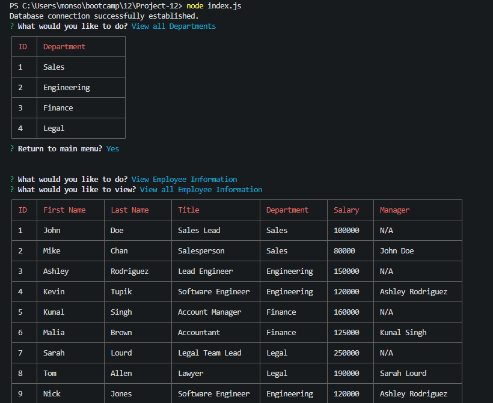
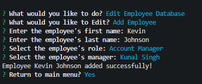

# Employee Tracker

This project creates a database for which we can use the terminal to monitor various aspects of our company. We can view departments, roles, employees, and even query some interesting things. We can assign different roles and departments to our employees, we can view what each role has for a salary, and we can even change who is a manager to who. We also have the ability to create new roles, new employees, and new departments. And when we are feeling like we've had enough of them, we can delete those same things we created.

## Usage

Video Walkthough Link:

https://drive.google.com/file/d/1oJU75T-7fixT57OcxLvePJDdoT0mETXz/view?usp=sharing